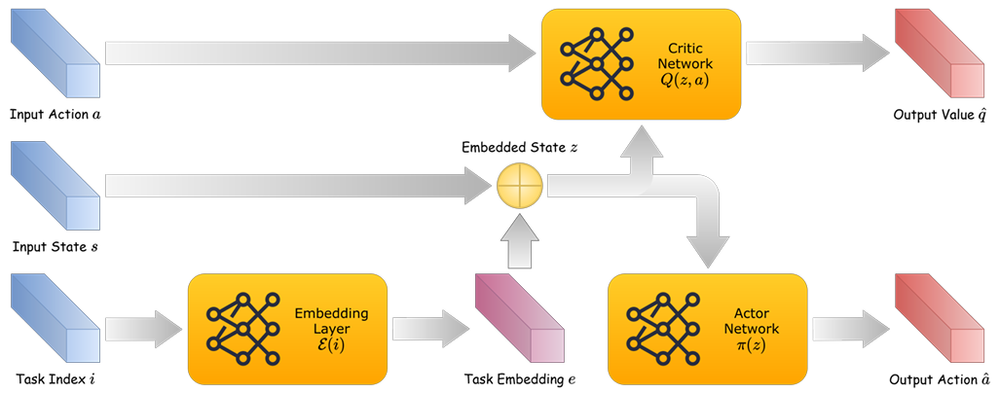
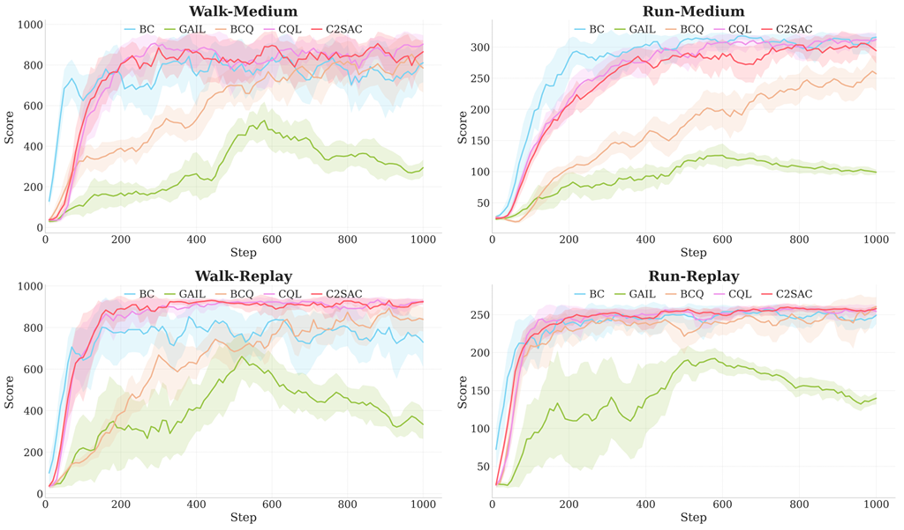
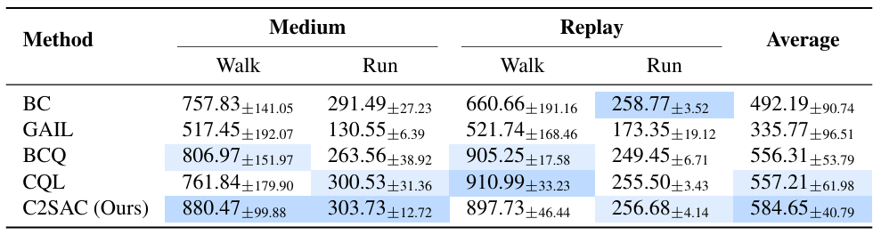
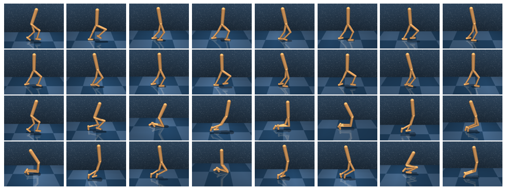

<h1 align="center">C2SAC: Cross-Task Conservative Soft Actor-Critic</h1>
<p align="center">Project of IERG5350 Reinforcement Learning, Spring 2026, CUHK</p>



Offline reinforcement learning avoids costly online interaction by learning from pre-collected, static datasets, but suffers from distribution shift. This challenge is further compounded in multi-task settings, where transitions from one task can originate from a behavior policy with a distinct reward structure, introducing harmful inter-task contamination when shared naively. In this project, we propose **C**ross-Task **C**onservative **S**oft **A**ctor-**C**ritic (**C2SAC**), a unified framework built on the maximum-entropy SAC backbone that integrates three complementary components: (i) a CQL-based conservative critic objective that suppresses OOD overestimation; (ii) a learned task-aware embedding that conditions both the actor and critics on a compact task representation, enabling structured knowledge sharing without conflating task-specific dynamics; and (iii) conservative data sharing (CDS), which leverages the learned conservative Q-values to admit only demonstrably beneficial cross-task transitions into each task's training buffer. We evaluate C2SAC on the MuJoCo Walker2D benchmark with two tasks and two offline dataset qualities, comparing against baselines including BC, GAIL, BCQ, and CQL. Empirical results demonstrate that C2SAC achieves the highest overall average return, exhibits faster and more stable convergence across key settings, and more reliably avoids degenerate behavioral patterns, validating the effectiveness of coupling conservative value estimation with selective cross-task data reuse.

## ⚙️ Installation

Create a conda environment:

```bash
conda create -n c2sac python=3.10
conda activate c2sac
```

Install a compatible version of PyTorch:

```bash
pip install torch torchvision
```

Reinstall some tools to avoid conflicts:

```bash
pip install setuptools==65.5.0 pip==21.0
pip install wheel==0.38.0
```

Install the required packages:

```bash
pip install -r requirements.txt
```

## 🚀 Experiments

The datasets are collected from TD-3 agents trained on the `walker-walk` and `walker-run` tasks, containing two subsets of trajectories. The `medium` subset is sampled from a policy with medium performance and the `replay` subset is sampled from the replay buffer during training.

There are five agents implemented in this project, including behavioral cloning (BC), generative adversarial imitation learning (GAIL), batch-constrained Q-learning (BCQ), conservative Q-learning (CQL), and our proposed method C2SAC.

Run the following command to train a specific agent on a specific dataset:

```bash
python trainer.py agent=bc/gail/bcq/cql/c2sac setting.dataset_name=medium/replay
```

You can directly run all the experiments with the provided script:

```bash
python scripts/experiment.py
```

Run the following command to plot the figures demonstrated in the report:

```bash
python scripts/plot_figure/training_curve.py
python scripts/plot_figure/trajectory_visualization.py
```

## 🎬 Samples

The training curves of the agents are presented as follows:



The performance comparison of the agents is presented as follows:



The trajectory visualization of the agents is presented as follows:


